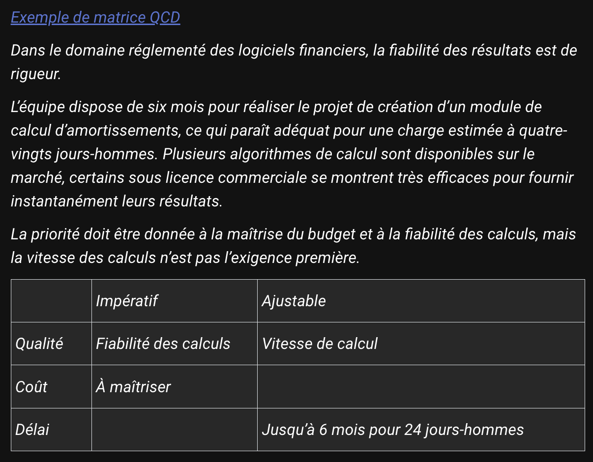

# L'Identification des Enjeux : La Fondation du Projet

## 🎯 Questions Fondamentales

- Quelles sont les motivations ?
- Qu'est-ce qui est primordial vs secondaire ?
- Quels sont les critères de réussite ?

## 📊 Importance des Enjeux

### Pour les grands projets

- Nécessaires pour l'engagement des ressources
- Évitent les risques d'échec

### Pour les petits projets

- Équilibrent réalisation et organisation
- Assurent un pilotage efficace

## 🔑 Cadre Stratégique Typique

- Renforcement commercial
- Conquête de marchés
- Transformation organisationnelle
- Rationalisation
- Partenariats stratégiques
- Fidélisation client

## 📋 Bonnes Pratiques

- 2 à 4 enjeux majeurs (recommandé)
- Focus sur le "quoi" et non le "comment"
- Alignement avec la stratégie d'entreprise

## 💡 Caractéristiques des Enjeux

Peuvent inclure :

- Objectifs stratégiques
- Éléments chiffrés
- Références aux dispositifs existants

## 🎯 Exemple Concret

1. Fiabiliser la mesure de satisfaction
2. Maximiser l'indice de satisfaction
3. Communiquer sur les évolutions et actions

