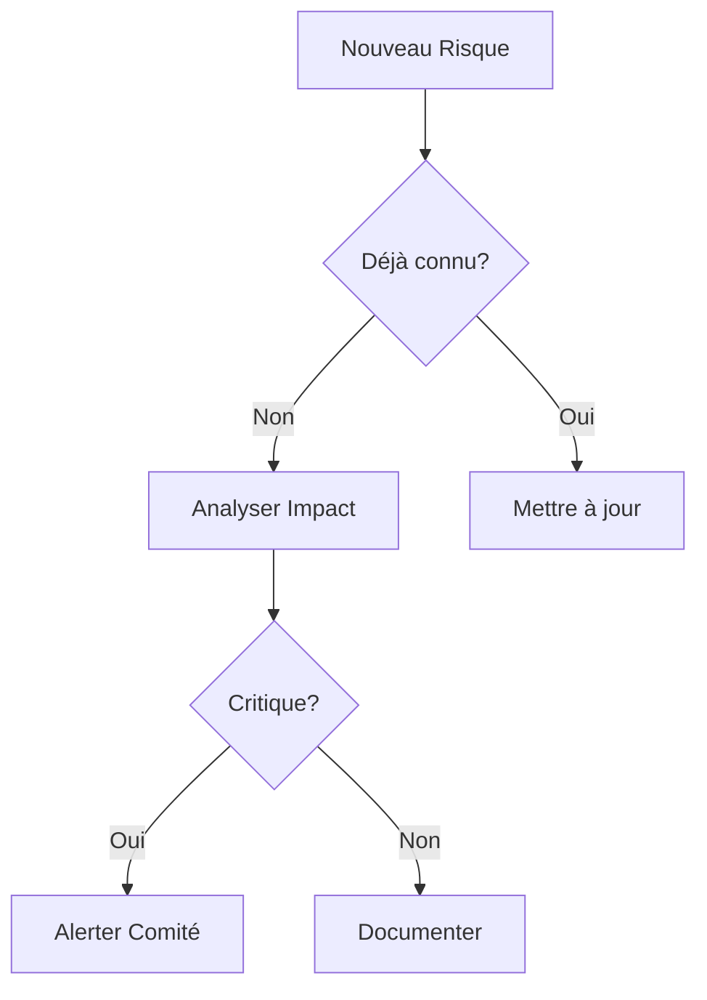

# L'Analyse et la Gestion des Risques

## Un élément crucial de la conduite de projet

---

## Introduction

- Importance de l'anticipation
- Impact sur la réussite du projet
- Approche méthodique nécessaire
- Vision préventive vs réactive

### Exemple Concret

```
Cas du projet X :
- Budget initial : 1M€
- Durée prévue : 12 mois
- Risque non identifié : dépendance technique
- Résultat : +60% budget, +8 mois
```

---

## 1. Classes de Risques

### Matrice de Classification

```
Impact    │ Faible  │ Moyen   │ Élevé   │ Critique
──────────┼─────────┼─────────┼─────────┼──────────
Probable  │ Moyen   │ Élevé   │ Critique│ Critique
Possible  │ Faible  │ Moyen   │ Élevé   │ Critique
Rare      │ Minimal │ Faible  │ Moyen   │ Élevé
Improbable│ Minimal │ Minimal │ Faible  │ Moyen
```

### Exemples par Catégorie

#### Risques Organisationnels

- ⚠️ Exemple : "Équipe de 3 devs pour projet estimé à 1000 j/h"
- 🔍 Signaux : Retards répétés, tension équipe
- ✅ Solution : Redimensionnement ou découpage

#### Risques Fonctionnels

- ⚠️ Exemple : "Processus métier non documenté"
- 🔍 Signaux : Contradictions utilisateurs
- ✅ Solution : Ateliers de modélisation

#### Risques Techniques

- ⚠️ Exemple : "Framework en version beta"
- 🔍 Signaux : Bugs récurrents
- ✅ Solution : Downgrade ou alternative

---

## 2. Processus d'Identification

### Checklist Systématique



### Exemple de Session d'Identification

```
Étape 1: Brainstorming individuel (10 min)
Étape 2: Partage en binôme (15 min)
Étape 3: Consolidation (20 min)
Étape 4: Priorisation (15 min)
```

---

## 3. Quantification et Suivi

### Tableau de Bord Type

```
Risque      │Prob│Sév│Coût│Tendance│Actions
────────────┼────┼───┼────┼────────┼────────
Tech Stack  │ 75%│ 3 │300k│   ↗️   │En cours
Data Volume │ 25%│ 2 │100k│   →    │Planifié
Security    │ 50%│ 3 │250k│   ↘️   │Terminé
```

### KPIs de Suivi

- 📊 Nombre de risques critiques
- 📈 Évolution mensuelle
- 💰 Budget risque consommé
- ⏱️ Délai moyen de traitement

---

## 4. Stratégies de Mitigation

### Matrice de Décision

```
Probabilité/Impact │ Éviter │ Transférer │ Réduire │ Accepter
──────────────────┼────────┼────────────┼─────────┼─────────
Critique          │   X    │     X      │         │
Élevé            │   X    │     X      │    X    │
Moyen            │        │            │    X    │    X
Faible           │        │            │         │    X
```

### Exemples de Plans d'Action

1. **Risque Technique**

   ```
   - Action: POC sur nouvelle techno
   - Durée: 2 semaines
   - Budget: 15k€
   - Go/NoGo: Performance > 1000 TPS
   ```

2. **Risque Organisationnel**
   ```
   - Action: Formation équipe
   - Durée: 5 jours
   - Budget: 8k€/pers
   - Validation: Certification
   ```

---

## 5. Impact sur les Modèles de Développement

### Matrice de Compatibilité

```
Risque    │Cascade│ V-Model │Agile │RAD
──────────┼───────┼─────────┼──────┼─────
Technique │   -   │    +    │  ++  │  -
Métier    │   +   │    +    │  ++  │  +
Planning  │   --  │    -    │  +   │  ++
Budget    │   +   │    +    │  -   │  --
```

### Exemples de Choix

```
Cas 1: Projet Critique
- Risques techniques élevés
- Budget fixe
➡️ Choix: Cycle en V

Cas 2: Time-to-Market
- Risques métier élevés
- Planning serré
➡️ Choix: Agile
```

---

## 6. Outils et Documentation

### Template de Fiche Risque

```markdown
# RISK-2024-001

## Description

[Description courte du risque]

## Impact

- Financier: [Montant]
- Planning: [Délai]
- Qualité: [Impact]

## Actions

- [ ] Action 1
- [ ] Action 2

## Suivi

🟢 Ouvert | 🟡 En cours | 🔴 Critique
```

### Base de Connaissances

- 📚 Catalogue de risques types
- 📝 Retours d'expérience
- 🔄 Patterns récurrents
- 📊 Statistiques de résolution

---

## Conclusion et Bonnes Pratiques

### Checklist Quotidienne

```
✓ Revue des risques actifs
✓ Mise à jour des statuts
✓ Communication équipe
✓ Escalade si nécessaire
```

### Facteurs Clés de Succès

1. Implication continue
2. Documentation rigoureuse
3. Communication proactive
4. Apprentissage continu
